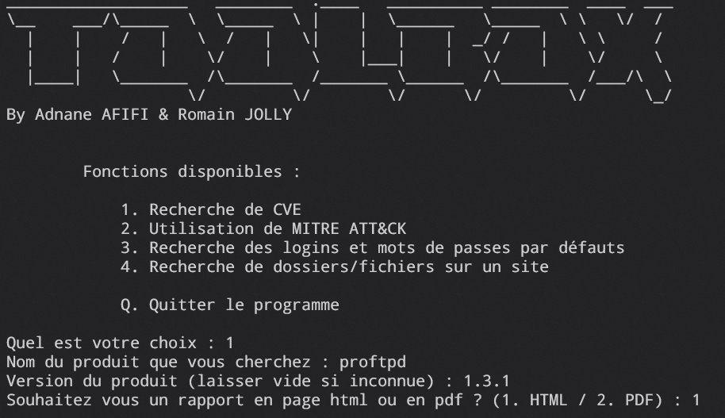
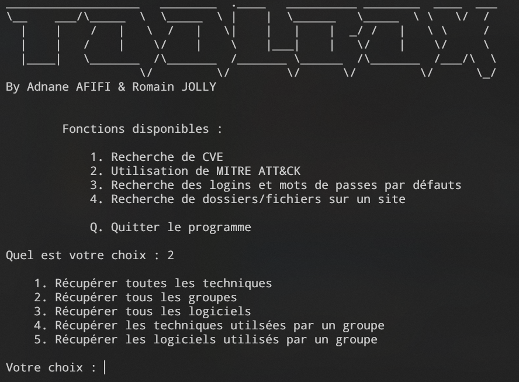
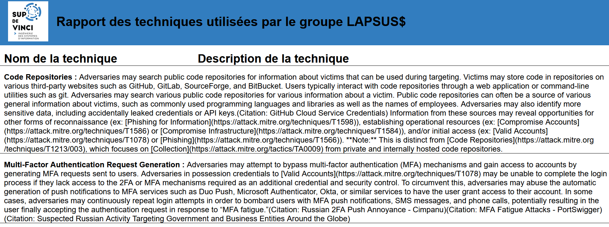
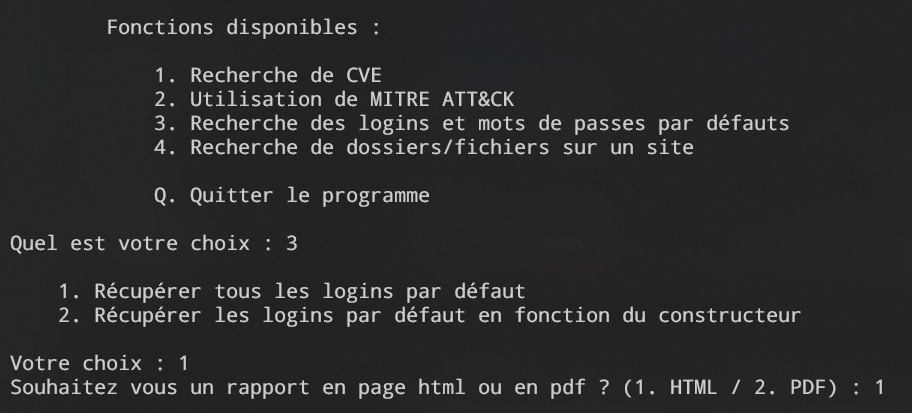
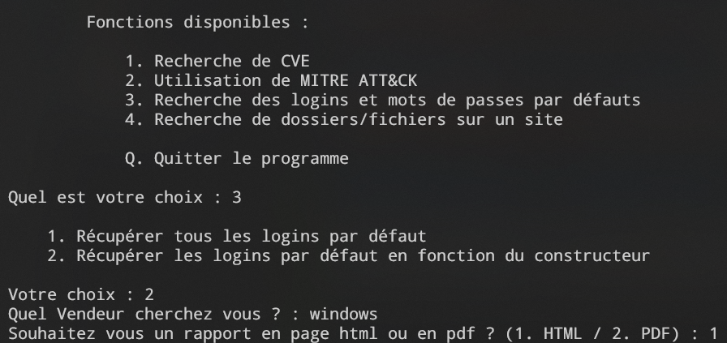
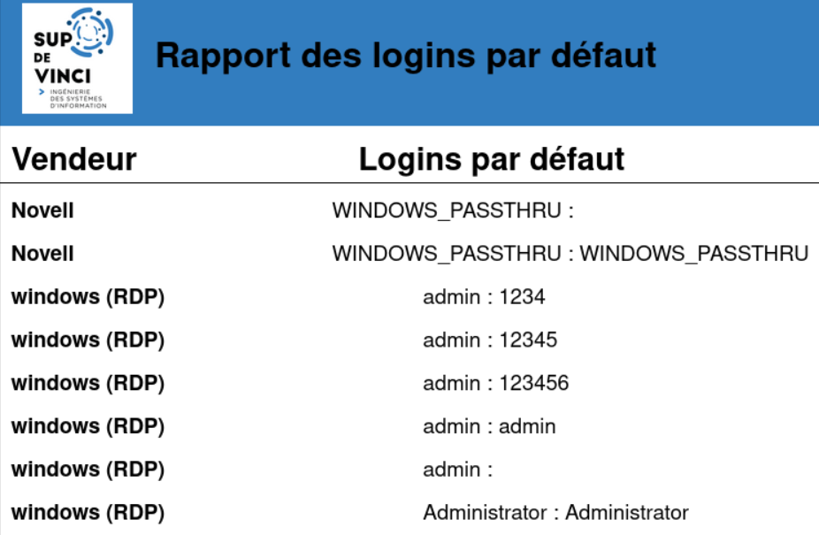
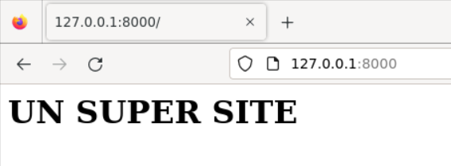

# Booteres
Booteres est un projet développé dans le cadre d'un master en cybersécurité à l'École Sup de Vinci. Il s'agit d'un projet de test d'intrusion visant à automatiser les premières étapes d'un test d'intrusion qui vous permet d'automatiser les premières étapes d'un test d'intrusion : reconnaissance, énumération et numérisation. Cette toolbox inclut également un complément OSINT qui vous aide à collecter des informations sur votre cible.Ce projet est conçu pour nous aider à mieux comprendre les principes de base de la cybersécurité et à développer nos compétences en matière de test d'intrusion et d'automatisation.


## Table des matières

- Introduction
- Avant Utilisation
- Lancement de la ToolBox
- Récupération des CVE
- Interaction avec MITRE ATT&CK


## Introduction

Nous faisons partie d’un SOC en tant qu’Analyste redteam, il nous est demandé de réaliser l’automatisation d’action que nous réalisons tous les jours afin de gagner du temps sur nos tâches journalières. Nous avons donc mit en place différentes fonctions comme la recherche de CVE, le scan réseau et autre.


## Avant Utilisation

Avant de pouvoir lancer la ToolBox, il est important d'effectuer quelques actions sans quoi vous aurez des erreurs.

Installez les modules :
```bash
python3 -m pip install -r requirements.txt
```

Installez le logiciel wkhtmltopdf (nécessaire pour le bon fonctionnement de pdfkit) :
```bash
sudo apt install wkhtmltopdf
```

Pour retrouver les rapports générés par les différentes fonctions, tous les rapports sont stockés dans le dossier 'reports' qui sera créé au moment de la génération s'il n'existe pas


## Lancement de la ToolBox
Un avertissement d'utilisation de cette outil pour informer les utilisateurs potentiels sur les risques associés à l'utilisation de cet outil.Cela va aider à assurer la responsabilité des utilisateurs dans l'utilisation de l'outil de test d'intrusion, ainsi qu'à protéger les systèmes cibles, les données et les personnes contre les conséquences néfastes de l'utilisation abusive de l'outil.


Pour lancer la ToolBox, il suffit de rentrer dans un terminal `python3 main.py` ou `./main.py`, cela vous amènera sur le menu suivant qui vous permettra de choisir la fonction à exécuter :


Vous pourrez ensuite choisir quelle fonction utiliser en fonction du chiffre que vous rentrez


## Récupération des CVE

Après avoir effectué un scan NMAP d'une ou plusieurs machines, vous souhaitez récupérer une liste des CVE d'un ou plusieurs services tournant sur ces machines. Avec cette fonction, il est possible de rechercher des CVE listées sur le site [CVE mitre](https://cve.mitre.org/) en fournissant le nom exact du logiciel avec la possibilité ou non de précisé la version souhaitée si elle est connue.

exemple avec proftpd 1.3.1 :


rapport généré :


Pour récupérer la liste des CVE, cette fonction utilise le module BeautifulSoup de python, c'est un module qui permet de scrapper une page web en fonction des tag, id, class et autres paramètres des balises. en effectuant une requête GET au site `cve.mitre.org/cgi-bin/cvekey.cgi?keyword=` tout en ajoutant en paramètres derrière 'keyword' le nom du logiciel + la version, tout cela permet de récupérer la page contant la liste des CVE demandées, grâce à BeautifulSoup nous scrappons cette page afin de ne récupérer que les CVE donc l'ID de la CVE ainsi que sa description que nous mettons ensuite dans une page html afin de soit générer le rapport en html soit convertir celui-ci en pdf avec pdfkit


## Interaction avec MITRE ATT&CK

Le framework MITRE ATT&CK est un framework créé par la société MITRE. C'est une base de connaissance qui répertorie les tactiques et les techniques utilisées par les groupes de cybercriminels. Cela permet donc de se tenir au courant des nouvelles techniques utilisées par les cybercriminels

Afin de pouvoir interagir avec le framework MITRE ATT&CK nous utilisons le module python [attackcti](https://attackcti.com/intro.html) qui est un module qui a été développé spécialement pour interagir avec ce framework et récupérer différentes informations

Utilisation de la fonction :


Nous avons plusieurs fonction de disponibles avec cette fonction :

1. **Récupération de toutes les techniques :** Permet de récupérer la liste de toutes les techniques utilisées par tous les groupes

2. **Récupération de tous les groupes :** Permet de récupérer la liste complète des groupes de cybercriminels

2. **Récupération de tous les logiciels :** Permet de récupérer la liste complète de tous les logiciels

4. **Récupérations des techniques des groupes :** Permet de récupérer toutes les techniques utilisées par un groupe précis  
Exemple avec LAPSUS$  



5. **Récupération des logiciels par groupe:** Permet de récupérer les logiciels utilisés ou attaqués par un groupe  
Exemple avec LAPSUS$  


## Récupération login et mot de passe par défaut

Lorsque vous trouvez des services en lignes, beaucoup demandes de se connectés, parfois les paramètres de ceux-ci peuvent restez ceux par défaut. Étant donné que tout les accès par défauts mis en place par les constructeurs sont connus, il est possible de se connecter si jamais ils n'ont pas été modifiés. Avec ce modules vous pouvez lister les logins et mots passes de chaques constructeurs ou bien de les chercher en fonction du constructeur choisi.  
  
Récupération de tous les logins et mots de passe :  
  
  
Récupération avec choix du constructeur :  




## Récupérer les dossiers ou fichiers d'une page web

Sur une page web, il est possible qu'il se cache des dossiers ou des fichiers, ce module vous permet de récupérer ceux-ci grâce à des requêtes GET effectuées sur l'URL spécifiée en utilisant des mots clef présents dans les wordlists situées dans `files/wordlists`, vous pourrez choisir la wordlist que vous souhaitez, en fonction du choix les résultats ne seront pas forcément les même.  

Par exemple si vous avez un site de ce genre où vous souhaitez trouver des documents intéressants ou bien tout simplement non indexé :  

  
Récupération des dossiers :  


## Licence

Ce projet est sous licence [GPL-3.0](https://choosealicense.com/licenses/gpl-3.0/)
